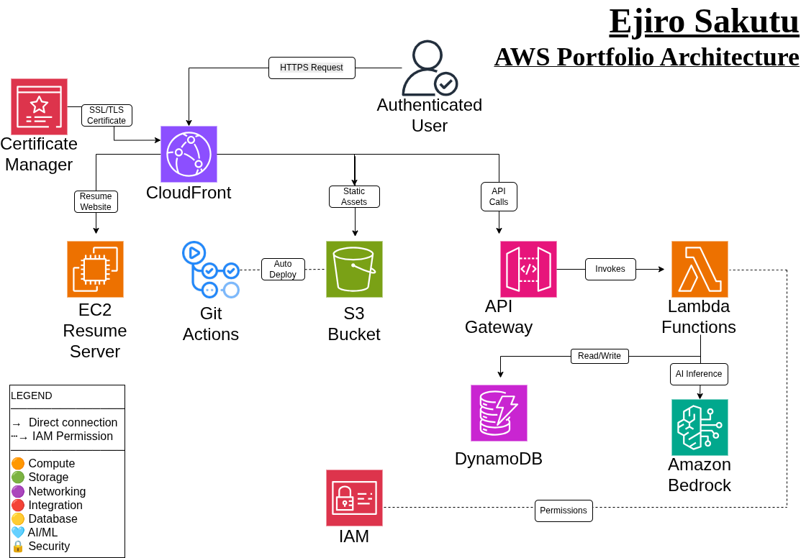

# Ejiro Sakutu — AWS Portfolio

## Architecture Diagram

## Live Projects
-  [Resume Website](https://d2wwi6wx69tjrn.cloudfront.net)
-  [AI Chatbot](https://d3ipadtt6x7vlf.cloudfront.net)

## AWS Services Used
EC2 | S3 | Lambda | DynamoDB | API Gateway | CloudFront | Bedrock | IAM | ACM | CloudWatch | GitHub Actions

## Projects Built
- ✅ Resume Website — EC2, Apache, CloudFront
- ✅ Serverless AI Chatbot — Lambda, Bedrock, API Gateway
- ✅ Dynamic Resume — S3, DynamoDB, Lambda, CloudFront
- ✅ Visitor Counter — DynamoDB, Lambda, API Gateway
- ✅ CI/CD Pipeline — GitHub Actions, S3, CloudFront
- ✅ CloudWatch Dashboard — CloudWatch
- ✅ Architecture Diagram — draw.io + AWS Icons
