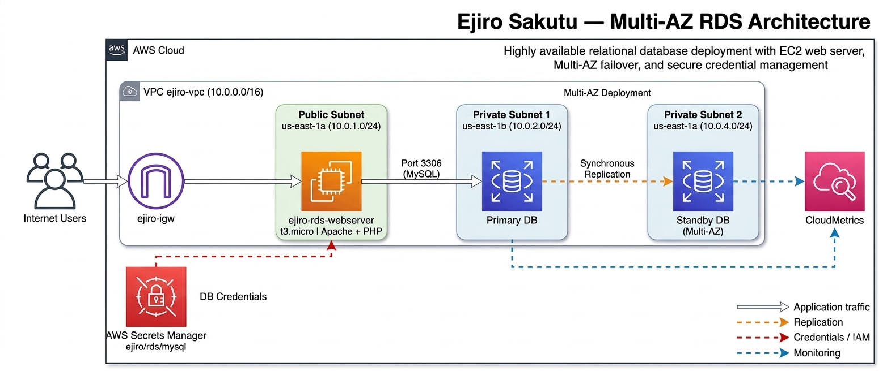

# Project 13 — Multi-AZ RDS with EC2 and Secrets Manager

## Overview
A two-tier web application with an Apache/PHP web server on EC2 in the public subnet connecting to a MySQL RDS database in the private subnet, with credentials stored in AWS Secrets Manager.

## Services Used
- **EC2** — t3.micro, Amazon Linux 2023, Apache + PHP
- **RDS MySQL** — 8.0.45, db.t3.micro, private subnet
- **Secrets Manager** — ejiro/rds/mysql
- **VPC** — Public/private subnet separation
- **Security Groups** — ejiro-public-sg, ejiro-rds-sg
- **CloudWatch** — RDS metrics monitoring

## Architecture
```
Internet → IGW → EC2 (Public Subnet) → RDS MySQL (Private Subnet)
                                               ↑
                                       Secrets Manager
```

## Key Concepts Demonstrated
- Public/private subnet separation for security
- RDS in private subnet with no public IP
- Security group referencing for port 3306 access
- Secrets Manager for credential storage
- Multi-AZ architecture pattern for high availability

## Architecture Diagram

