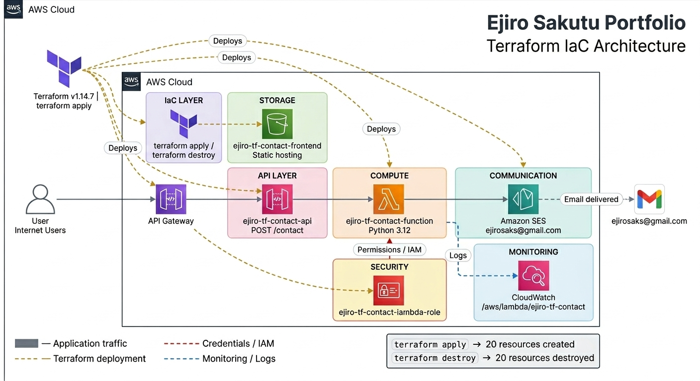

# Project 14 — Infrastructure as Code with Terraform

## Overview
A complete serverless contact form infrastructure deployed entirely using Terraform — no console clicking. One command builds everything. One command tears it all down.

## Services Used
- Terraform — Infrastructure as Code (v1.14.7)
- Lambda — Python 3.12 function
- API Gateway — REST API (Edge-optimised)
- S3 — Static website hosting
- SES — Email delivery
- IAM — Roles and permissions
- CloudWatch — Logs and monitoring

## Project Structure
```
contact-form/
├── main.tf
├── variables.tf
├── outputs.tf
├── lambda/
│   └── contact.py
```

## Architecture

Terraform provisions a fully serverless architecture where API Gateway triggers a Lambda function that processes form submissions and sends emails via SES, with a static frontend hosted on S3.
## Deployment
```bash
terraform init
terraform plan
terraform apply
```

## Cleanup
```bash
terraform destroy
```

## Lessons Learned
- Terraform enables full infrastructure automation
- Small IAM misconfigurations can break deployments
- Destroying and rebuilding is often faster than debugging
- Structuring Lambda functions correctly is critical

## Future Improvements
- Add DynamoDB for message storage
- Add frontend validation
- Refactor into Terraform modules
